# Curso de Bootstrap 4.0

SEMANA 2

Tutor:Ezequiel Lamónica

# 1 la barra de navegación queda fija en la parte superior, es decir, que por más que te deslices hacia abajo, la barra siempre permanece visible al tope de la página.
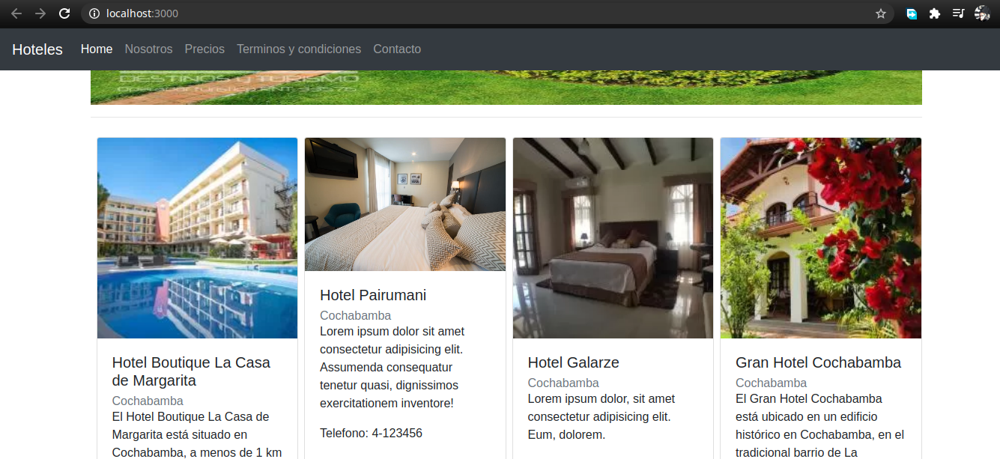

# 2 la versión responsive de la barra que se ve bien en los diferentes dispositivos.
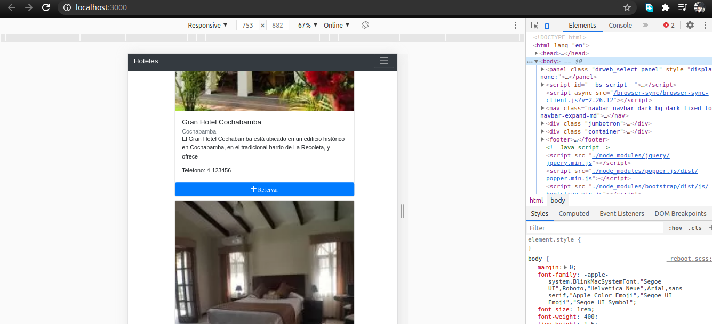

# 3 los componentes breadcrumbs en las diferentes páginas y asegúrate que estén vinculando a las páginas correspondientes y ubicando al usuario en el mapa de sitio que corresponde.

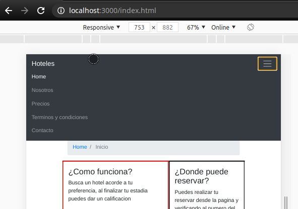
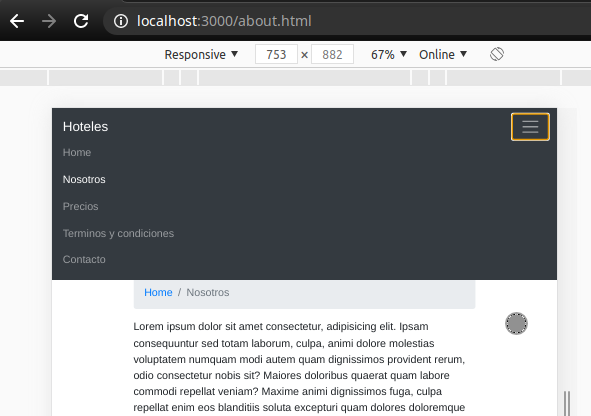
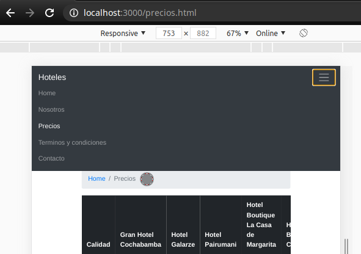
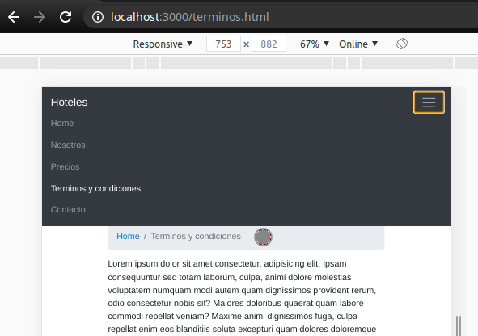
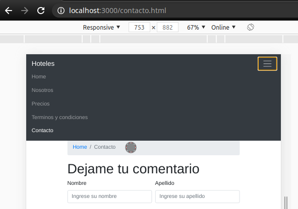

# 4 un formulario para dejar un comentario, entrar en contacto con el sitio o suscribirse a algún servicio o compra que se ofrezca en el sitio. Los labels están agrupados con los controles correspondientes y mantiene la alineación y ubicación de los elementos de forma armónica. El formulario incluye campos de: email, de listado seleccionable, checkbox, texto y textarea.
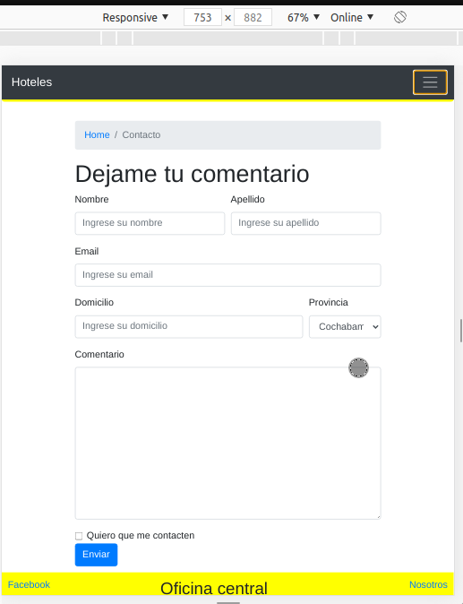

# 5 la librería open-iconic y algunos iconos en la tabla que ilustran la información
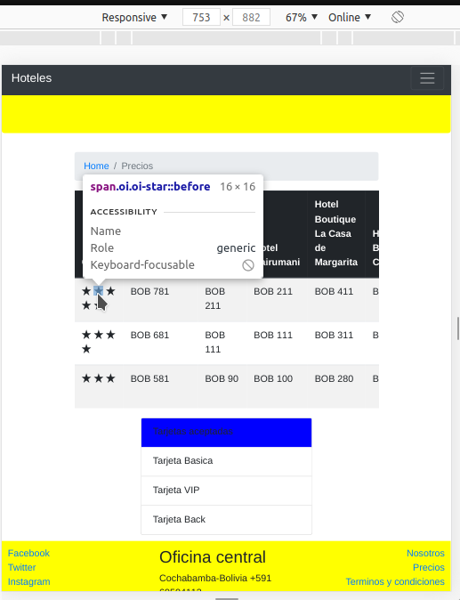

# 6 el contenido de la tabla puede verse con scroll sin deformar la página.
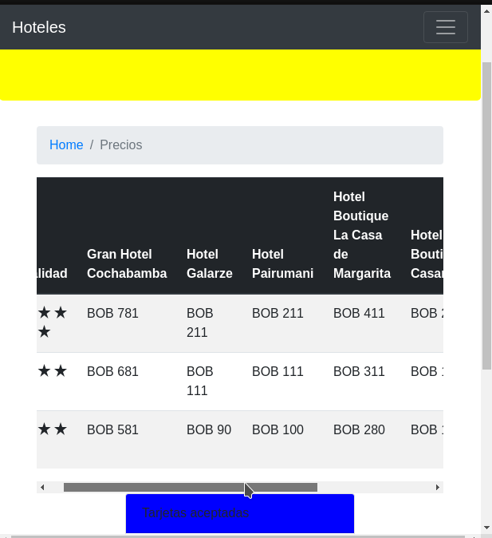

# 7 En la página principal, el listado de productos utiliza el componente card con los títulos, cuerpo y footer.
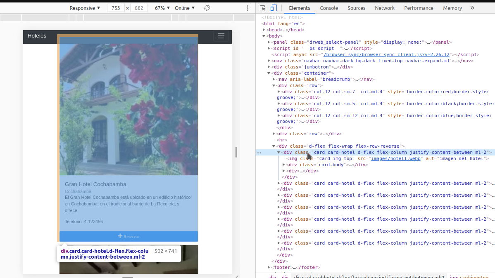

# 8 la disposición de los elementos (márgenes y padding, atributos de flex, etc.) es prolija y moderna.
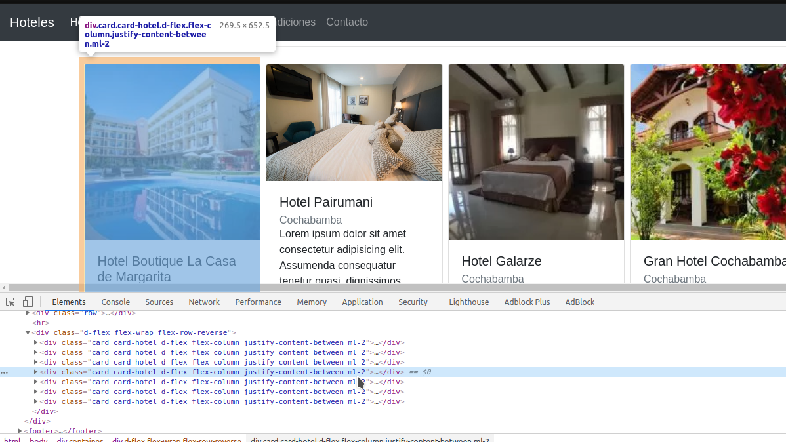

# 9 una imagen en cada una de las cards que representen el artículo que estás ofreciendo.
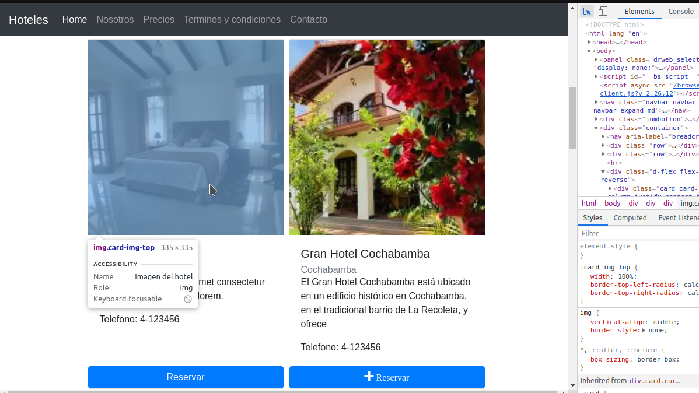

# 10 una imagen en la página principal a modo de banner o encabezado que haga atractivo el sitio o muestre una promoción. Utiliza los componentes adecuados para este propósito.

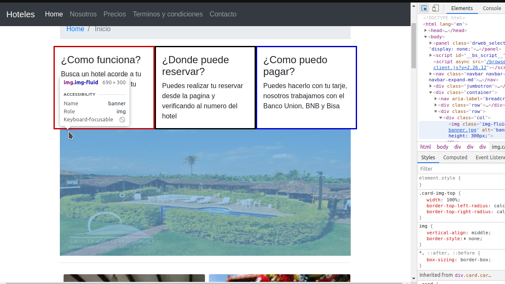

