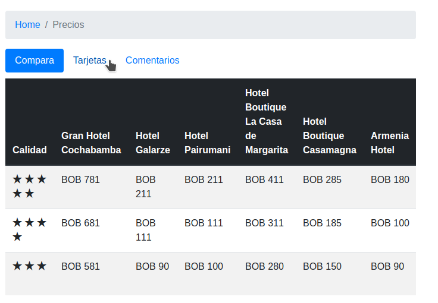
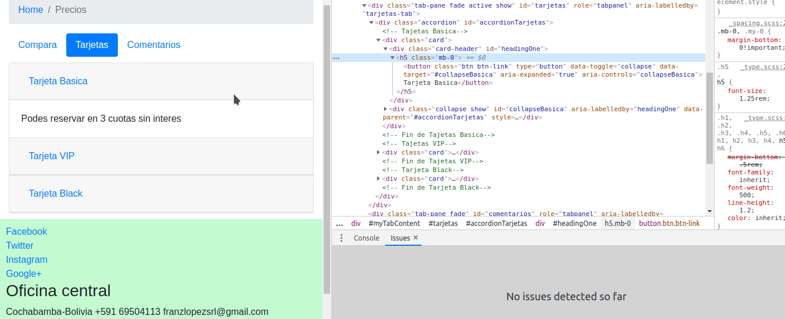
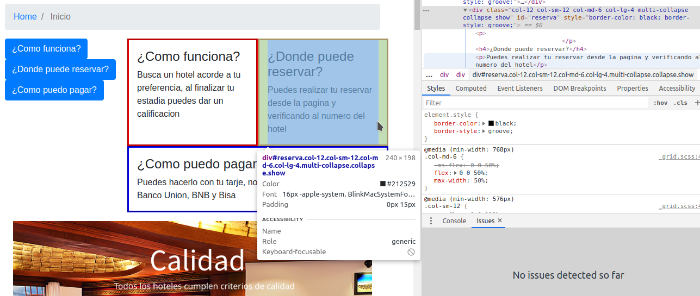
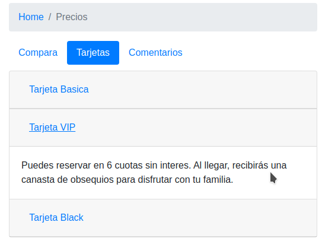
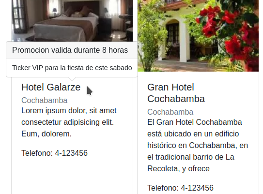
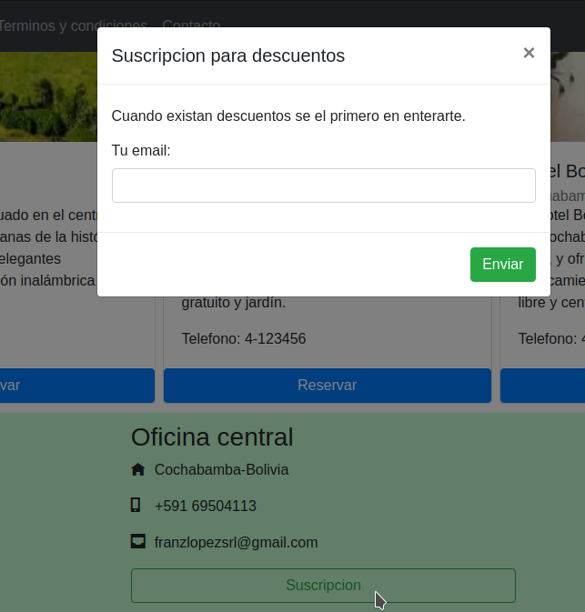
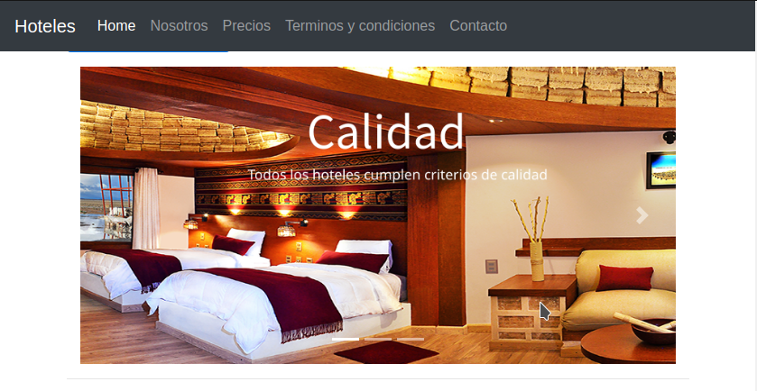

# Curso de Bootstrap 4.0

SEMANA 2

Tutor:Ezequiel Lamónica

# 1 tabs o pills en alguna sección del sitio. Por ejemplo, tabla comparativa, opciones de pago, información para la compra, etc. y su versión responsive se ve correctamente.

# 2 secciones que muestran información utilizando el componente collapse y multi collapse.

# 3 el componente accordion en alguna sección donde muestre un listado de opciones (p. ej. opciones de pago con tarjetas en la sección de precios).

# 4 información de contexto via tooltips o popovers en los títulos de los productos mostrados en las cards.

# 5 un componente modal sobre el final del body que invite al usuario a dejar sus datos o a registrarse.

# 6 un formulario para que el usuario complete en el cuerpo del modal.

# 7 un botón que abra el modal.

# 8 un componente carousel en la parte superior de la página principal, que muestre algo merecedor de notoriedad.

# 9 controles de desplazamiento sobre el carousel.

# 10 un script que modifique la velocidad de desplazamiento a tu criterio.

